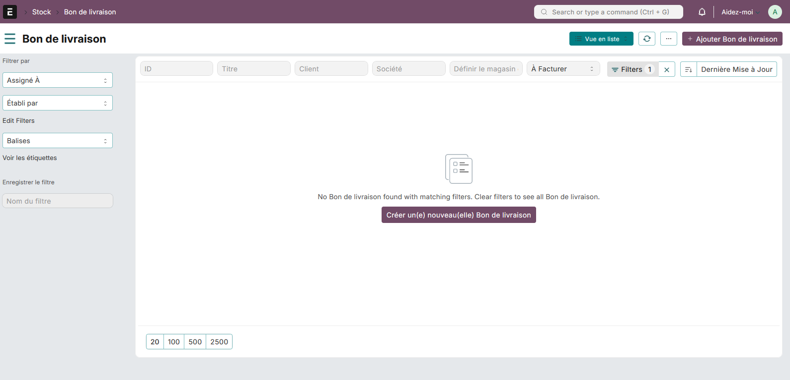
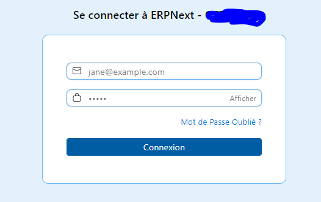

## NEWARA

TEMPLATE FRAPPE NEWARA
CSS DESIGN LIKE ODOO


#### For login page:
<p>
Add the css file in Website Settings, Header TAB:<br>
&lt;link rel="stylesheet" href="/assets/newara/css/newara.css"&gt;
</p>


#### Per-customer theme override (Desk)

1. Create a CSS file under `newara/public/css/themes/` with your customer's palette. Start from the sample:

   - `newara/public/css/themes/customer-sample.css`

   Override `:root` variables like `--btn-primary`, `--secondary`, `--navbar-bg`, etc.

2. Build assets so the file is available under `/assets`:

```
bench build
```

3. Set the theme name (file name without `.css`) in your site's `site_config.json`:

```json
{
  "newara_theme": "customer-sample"
}
```

4. Reload Desk (or `bench restart` and clear cache):

```
bench clear-cache && bench clear-website-cache
```

The loader `newara/public/js/theme_loader.js` injects `/assets/newara/css/themes/<name>.css` at runtime for Desk UI.

#### License

mit
